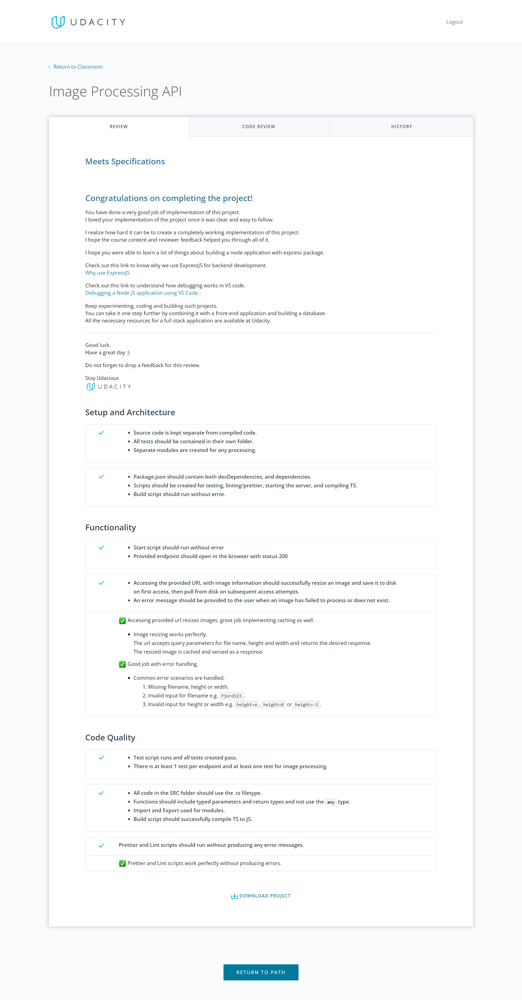

# image processing Api

Create an image processing API that resizes and saves images to user specifications

## Description

Create an image processing API that resizes and saves images to user specifications when visiting a URL

## Udacity review about this project



### Installing

- You cane download my project.

```
git clone https://github.com/aml-fakhry/first_project-fwd_web_advanced.git
```

- project requires having node installed https://nodejs.org/en/download/

### Executing program (scripts)

- Install all dependencies

```
npm install
```

- Run the program in development environment.

```
npm run dev
```

- Run compiled code (build).

```
npm run start:build
```

- Run test program.

```
npm test
```

- Lint script.

```
npm run lint
```

- Format script.

```
npm run format
```

- clear thumb images script.

```
npm run clearThumb
```

## Endpoints

1- Resize image endpoint http://localhost:3000/api/images?filename=pic1&width=200&height=200

- [](https://app.getpostman.com/run-collection/125bacc47857a5b173da?action=collection%2Fimport)

## Functionality

1- Resize image

- resizeImage() method to resize images.
- @param filename the file name to be processed.
- @param width the width of image.
- @param height the height of image.
- @returns promise of data result.

```
(method) resizeImage(filename: string, width: number, height: number): Promise<DataResult>
```

## Unit tests.

1- Check if image exist in full or thumb folders.

```javascript
describe('Check if image exist in full or thumb folders.', () => {
  it('Pass when image exist in full folder.', () => {
    const result = fs.existsSync(fullPic1Path);
    expect(result).toBeTruthy();
  });

  it('Pass when image not exist in full folder.', () => {
    const result = fs.existsSync(thumbPic1Path);
    expect(result).not.toBeTruthy();
  });
});
```

2- Check if returned data from resizeImage().

```javascript
describe('Check if returned data from resizeImage().', () => {
  it('Pass returned data from resizeImage().', async () => {
    const result = await imageProcessDataAccess.resizeImage('pic1', 300, 300);

    expect(result.data).toBeTruthy();
    expect(result.data.format).toBe('jpeg');
    expect(result.data.width).toBe(300);
    expect(result.data.width).toBe(300);
    expect(result.validationErrors).toBeUndefined();
    expect(result.isNotFound).toBeFalsy();
  });
});
```

2- Test image processing API.

```javascript
const request = supertest(app);
describe('Test image processing API', () => {
  it('Pass when response status equal 200', async () => {
    const response = await request.get('/api/images?filename=pic2&width=300&height=300');
    expect(response.status).toBe(200);
  });

  it('Pass when it fails because it is already processed.', async () => {
    const response = await request.get('/api/images?filename=pic2&width=300&height=300');
    expect(response.status).toBe(400);
    expect(response.text).toBe('Ooh, this image processed before please use a new one.');
  });
});
```

## License

This project is licensed under the Aml Fakhri License - see the LICENSE.md file for details

## Acknowledgments

Inspiration, code snippets, etc.

- [eslint](https://eslint.org/)
- [prettier](https://prettier.io/)
- [lint-staged](https://www.npmjs.com/package/lint-staged)
- [sharp](https://www.npmjs.com/package/sharp)
- [jasmine](https://jasmine.github.io/)
- [supertest](https://www.npmjs.com/package/supertest)

## Project structure.

```
.
📦src
┣ 📂assets
┃ ┣ 📂full
┃ ┃ ┣ 📜pic1.jpg
┃ ┃ ┣ 📜pic2.jpg
┃ ┃ ┗ 📜pic3.jpg
┃ ┗ 📂thumb
┣ 📂data
┃ ┣ 📜image-processing.data.ts
┃ ┗ 📜index.ts
┣ 📂routes
┃ ┣ 📂api
┃ ┃ ┣ 📜image.routes.ts
┃ ┃ ┗ 📜index.ts
┃ ┗ 📜index.ts
┣ 📂server
┃ ┣ 📜index.ts
┃ ┗ 📜server.ts
┣ 📂shared
┃ ┣ 📂middleware
┃ ┃ ┣ 📜error-handler.middleware.ts
┃ ┃ ┗ 📜index.ts
┃ ┣ 📂model
┃ ┃ ┣ 📜app-error-code.model.ts
┃ ┃ ┣ 📜app-error-model.ts
┃ ┃ ┣ 📜app-http-response-error.model.ts
┃ ┃ ┣ 📜app-http-response.model.ts
┃ ┃ ┣ 📜data-result.model.ts
┃ ┃ ┗ 📜index.ts
┃ ┣ 📂utils
┃ ┃ ┣ 📜http-response.util.ts
┃ ┃ ┣ 📜index.ts
┃ ┃ ┗ 📜logger.util.ts
┃ ┗ 📜index.ts
┣ 📂tests
┃ ┣ 📂helpers
┃ ┃ ┗ 📜reporter.ts
┃ ┗ 📜app.spec.ts
┗ 📜app.ts
```

## Authors

Contributors names and contact info

ex. Aml fakhri
ex. [@aml_fakhri](amlfakhry13@gmail.com)
